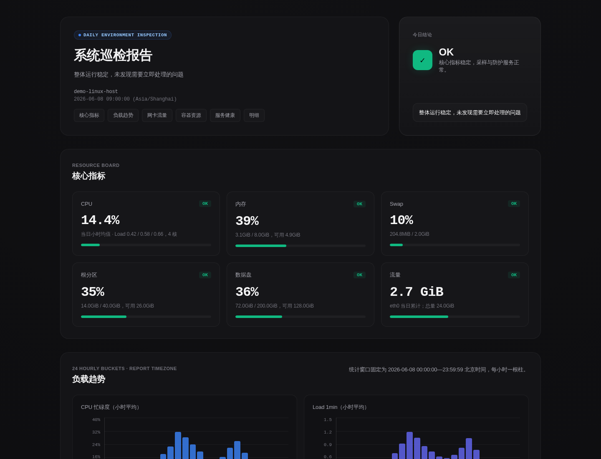

# System Inspection Report

System Inspection Report 是一个 Linux 每日巡检报告生成器。它会生成一份 HTML 报告和一份文本摘要，覆盖 CPU、Load、内存、Swap、磁盘、vnStat 流量、Docker 容器、systemd 单元、fail2ban 和本地安全事件。投递渠道支持 email 和 Telegram，默认关闭。

## 功能预览

以下截图使用脱敏示例数据生成，不包含真实主机、端口或业务信息。



## 功能

- 生成高对比度 HTML 巡检报告。
- 输出适合消息推送的文本摘要。
- CPU、Load、流量图表使用动态纵轴，低负载场景也保持可读。
- 支持 sysstat/sadf 的 CPU 和 Load 小时趋势。
- 支持 vnStat 网络流量统计，自动排除 Docker bridge、veth 和 loopback，也可指定网卡。
- 支持 Docker 容器资源 Top、健康检查状态和日志目录占用。
- 支持 systemd timer 定时执行。
- 支持 Telegram summary + HTML document 分别投递。
- 支持 `best-effort` 和 `strict` 投递语义。

## 快速开始

下面这组命令可以直接在一台 Linux 机器上跑起来。未安装可选采集工具时，对应模块会显示为空或 unknown，不影响报告生成。

```bash
git clone https://github.com/Cyberceratops/system-inspection-report.git
cd system-inspection-report
python3 -m venv .venv
. .venv/bin/activate
pip install -e .
SEND_EMAIL=0 SEND_TELEGRAM=0 REPORT_DIR=reports system-inspection-report root
```

成功后终端会输出生成的 HTML 路径，例如：

```text
reports/inspection-2026-06-08-090000.html
```

同时会生成同名摘要文件：

```text
reports/inspection-2026-06-08-090000.summary.txt
```

可选安装采集工具：

```bash
sudo apt-get update
sudo apt-get install -y sysstat vnstat curl
```

如果需要 Docker、fail2ban、email 投递能力，再按需安装 Docker、fail2ban 和 `mail` 命令。

## 配置

可以通过环境变量和 JSON 配置文件控制行为。环境变量优先级高于 JSON 配置。

本地试跑可以只用环境变量。长期部署建议复制示例文件：

```bash
sudo cp examples/env.example /etc/system-inspection-report.env
sudo cp examples/config.example.json /etc/system-inspection-report.json
sudo chmod 600 /etc/system-inspection-report.env
```

关键环境变量：

| 变量 | 含义 | 默认值 |
| --- | --- | --- |
| `REPORT_TZ` | 报告时区 | `Asia/Shanghai` |
| `REPORT_DIR` | 报告输出目录 | `reports` |
| `SYSTEM_INSPECTION_CONFIG` | JSON 配置路径 | 空 |
| `REPORT_NET_IFACE` | 指定 vnStat 网卡 | 自动选择非 Docker 接口 |
| `SEND_EMAIL` | 是否发送 email | `0` |
| `SEND_TELEGRAM` | 是否发送 Telegram | `0` |
| `DELIVERY_MODE` | `best-effort` 或 `strict` | `best-effort` |
| `TELEGRAM_BOT_TOKEN` | Telegram bot token | 空 |
| `TELEGRAM_CHAT_ID` | Telegram chat id | 空 |
| `ROOT_DISK_PATH` | 根分区统计路径 | `/` |
| `DATA_DISK_PATH` | 数据盘统计路径 | `/var/lib` |
| `DATA_ROOT` | 数据目录明细根路径 | `/var/lib` |

JSON 配置可设置：

- `log_paths`：日志空间占用列表，例如 `["System logs", "/var/log"]`
- `timer_units`：要展示的 systemd timer/service 列表
- `security_alert_dir`：本地安全事件 JSONL 目录
- `root_disk_path`、`data_disk_path`、`data_root`
- `network_interface`

## systemd 部署

```bash
sudo mkdir -p /opt/system-inspection-report
sudo rsync -a ./ /opt/system-inspection-report/
sudo cp examples/env.example /etc/system-inspection-report.env
sudo cp examples/config.example.json /etc/system-inspection-report.json
sudo chmod 600 /etc/system-inspection-report.env
sudo cp examples/system-inspection-report.service /etc/systemd/system/
sudo cp examples/system-inspection-report.timer /etc/systemd/system/
sudo systemctl daemon-reload
sudo systemctl enable --now system-inspection-report.timer
```

手动执行一次：

```bash
sudo systemctl start system-inspection-report.service
sudo journalctl -u system-inspection-report.service -n 100 --no-pager
```

## Telegram 投递

编辑 `/etc/system-inspection-report.env`：

```bash
SEND_TELEGRAM=1
TELEGRAM_BOT_TOKEN=replace-with-your-bot-token
TELEGRAM_CHAT_ID=replace-with-your-chat-id
```

Telegram 会分别发送：

1. 文本摘要
2. HTML 报告附件

两者失败会分别记录，便于排查。

## Email 投递

确保系统有 `mail` 命令，然后设置：

```bash
SEND_EMAIL=1
RECIPIENT=admin@example.com
```

## 投递模式

- `DELIVERY_MODE=best-effort`：报告生成成功即返回成功，投递失败写 stderr/journal。
- `DELIVERY_MODE=strict`：启用的投递渠道失败时返回非零。

## 隐私边界

默认配置不会发送 email 或 Telegram。报告内容会包含本机采集到的运行信息，例如主机名、容器名、systemd 单元名、日志路径和监听端口；在启用外部投递前，请确认接收方和报告内容符合你的使用场景。

## 许可证

MIT
